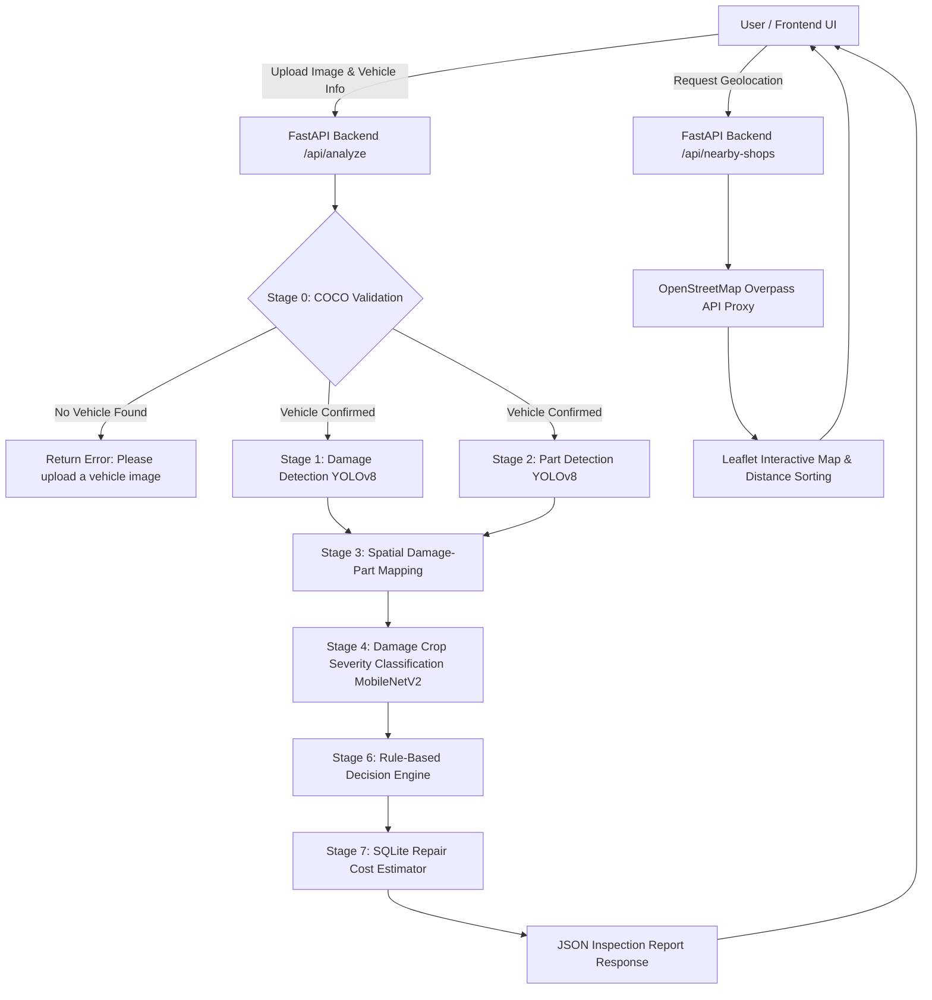

# 🚗 AutoInspect AI

AutoInspect AI is an end-to-end, multi-stage artificial intelligence system engineered for automated vehicle damage assessment, part localization, visual severity classification, actionable repair recommendation, and baseline cost estimation. By combining deep computer vision models with a spatial reasoning pipeline, a rule-based decision engine, an Indian vehicle market SQLite pricing database, and geospatial service locator APIs, the system transforms single vehicle photographs into structured, transparent inspection reports and connects users directly with nearby repair centers.


---

## 📌 Overview

### The Problem
Traditional physical vehicle damage assessment in auto insurance claims, car rentals, fleet management, and body shops is historically slow, subjective, and operationally costly. Claims adjusters and customers must manually inspect damage, leading to inconsistent severity grading, subjective repair vs. replacement decisions, prolonged approval workflows, and pricing opacity.

### The Solution
AutoInspect AI automates the initial visual triage process. When an end user or field agent uploads a vehicle photo, the application validates vehicle presence, detects damage types, localizes affected body parts, computes spatial overlap, classifies visual severity, applies safety-first decision matrices, projects repair/replacement costs, and displays nearby service centers—all within seconds.

> **Disclaimer:** AutoInspect AI estimates visible surface damage from standard photographs. It does not detect concealed mechanical, electrical, or internal structural frame damage. Estimated costs are non-binding baselines designed to assist preliminary assessments, not legally binding body shop guarantees.

---

## ✨ Key Features

- **Automated Vehicle Input Validation:** Pre-screens uploaded photos using generic COCO object detection (`YOLOv8n`) to verify car, bus, truck, or motorcycle presence before running heavy inspection pipelines.
- **Multi-Class Damage Detection:** Detects localized surface damages (`dent`, `scratch`, `crack`, `glass_shatter`, `lamp_broken`, `tire_flat`) fine-tuned on the CarDD dataset.
- **Vehicle Part Localization:** Localizes 12 key vehicle components (`front_bumper`, `rear_bumper`, `door`, `windshield`, `rear_windshield`, `headlight`, `taillight`, `side_mirror`, `hood`, `tailgate`, `trunk`, `tire`).
- **Spatial Damage-to-Part Mapping:** Computes bounding box centers and Intersection-over-Union (IoU) overlap to attribute each detected damage region strictly to its underlying vehicle part, with fallback to general `body`.
- **Visual Damage Severity Classification:** Crops padded damage regions (15% boundary padding) and runs a fine-tuned MobileNetV2 neural network to classify severity into `minor`, `moderate`, or `severe`.
- **Heuristic Anti-Hallucination Filtering:** Applies domain rules (e.g., filtering out low-confidence glass shatter predictions on windshields caused by tree or sun reflections).
- **Rule-Based Decision Engine:** Evaluates confidence thresholds across all pipeline models to generate actionable recommendations (`Repair`, `Replace`, or `Inspect`).
- **Database-Backed Cost Estimator:** Queries an SQLite database populated with OEM part prices, labor rates, and vehicle tiers (Hatchback, Compact SUV, SUV) for major Indian automobile models, generating itemized min-max estimates in INR.
- **Geospatial Repair Shop Locator:** Uses browser GPS coordinates and a FastAPI backend proxy to query the OpenStreetMap Overpass API, returning nearby auto body shops and tire centers sorted by Haversine distance with interactive Leaflet map rendering and Google Maps direction links.
- **Modern Interactive Web UI:** Built with React 19, Vite, Tailwind CSS, Lucide icons, WebRTC live camera capture, drag-and-drop uploads, and clipboard image pasting.

---

## 🧠 System Architecture



### Pipeline Execution Stages
1. **Validation (Stage 0):** Checks if the photo contains a vehicle (`car`, `bus`, `truck`, `motorcycle`) using `yolov8n.pt`.
2. **Damage Detection (Stage 1):** Scans the image for visual defect categories and bounding coordinates.
3. **Part Detection (Stage 2):** Scans the image for vehicle structural components and bounding coordinates.
4. **Spatial Mapping (Stage 3):** Determines spatial overlap between damage boxes and part boxes using center-in-box and IoU metrics.
5. **Severity Estimation (Stage 4):** Crops damage bounding boxes with 15% padding and passes them to MobileNetV2 for severity prediction.
6. **Decision Engine (Stage 6):** Aggregates confidences, applies reflection suppression, and checks rule matrices to assign `repair`, `replace`, or `inspect`.
7. **Cost Estimator (Stage 7):** Queries the SQLite pricing database for part costs and labor rates, calculating total itemized expenses.

---

## 🔬 AI / ML Pipeline

### Model 1 — Damage Detection
- **Architecture:** YOLOv8 Nano (`yolov8n.pt` backbone)
- **Dataset:** CarDD (Car Damage Dataset)
- **Detected Classes (6):** `dent`, `scratch`, `crack`, `glass_shatter`, `lamp_broken`, `tire_flat`
- **Inference Behavior:** Operates at confidence threshold `conf=0.15` to preserve sensitivity for fine glass fractures and surface scratches.
- **Model Weights Path:** `models/cardd_model/exp/weights/best.pt`

### Model 2 — Vehicle Part Detection
- **Architecture:** YOLOv8 Nano (`yolov8n.pt` backbone)
- **Dataset:** Ultralytics Carparts-Seg (3,833 images: 3,156 train / 401 val / 276 test)
- **Target Mapped Classes (12):** `front_bumper`, `rear_bumper`, `door`, `windshield`, `rear_windshield`, `headlight`, `taillight`, `side_mirror`, `hood`, `tailgate`, `trunk`, `tire`
- **Validation Performance (Epoch 33):**
  - **mAP@50:** 0.681 (68.1%)
  - **mAP@50-95:** 0.537
  - **Precision:** 0.563
  - **Recall:** 0.729
  - **Top Performing Classes:** `front_glass` (mAP50: 0.981), `front_bumper` (mAP50: 0.972), `hood` (mAP50: 0.972)
- **Known Limitations:** Does not include `fender` or `grille` labels in the underlying dataset (damages in these regions fall back to `body` or adjacent bumpers/doors). Extreme close-up photos lacking structural context can reduce part detection confidence.
- **Model Weights Path:** `models/parts_model.pt`

### Model 3 — Damage Severity Classification
- **Architecture:** MobileNetV2 (ImageNet1K pretrained backbone + custom Dropout/Linear classifier head)
- **Dataset:** Vehicle Damage Severity Dataset (Kaggle)
- **Severity Categories (3):** `minor`, `moderate`, `severe`
- **Preprocessing:** Extracts padded damage bounding box crops (15% padding ratio), resizes to 224x224, standardizes color channels, and executes PyTorch inference.
- **Validation/Test Performance (248 test samples):**
  - **Overall Accuracy:** 65.7%
  - **Weighted Precision:** 68.9%
  - **Weighted Recall:** 65.7%
  - **Weighted F1-Score:** 66.7%
  - **Per-Class Breakdown:**
    - `minor`: Precision 80.3% | Recall 64.6% | F1 71.6%
    - `severe`: Precision 77.1% | Recall 70.3% | F1 73.6%
    - `moderate`: Precision 46.5% | Recall 61.3% | F1 52.9%
- **Model Weights Path:** `stages/severity_estimation/models/severity_model_best.pt`

---

## 🔗 Multi-Stage Damage Assessment

The outputs of Model 1 (Damage Bounding Boxes) and Model 2 (Part Bounding Boxes) are dynamically paired in **Stage 3 (Spatial Mapping)** before being evaluated by downstream stages.

```
Damage Bbox (Model 1) + Part Bbox (Model 2)
                   ↓
   Center-in-Box + IoU Score Calculation
                   ↓
        Damage-to-Part Attribution
                   ↓
   Padded Crop & Severity Classifier (Model 3)
                   ↓
       Rule-Based Decision Matrix (Stage 6)
                   ↓
         SQLite Pricing Lookup (Stage 7)
```

### Spatial Matching Logic
For every detected damage box `D` and part box `P`:
1. **Center Point Check:** Checks whether the center point `(dcx, dcy)` of damage `D` lies inside part box `P`.
2. **IoU Calculation:** Computes standard Intersection-over-Union $IoU(D, P)$.
3. **Composite Match Score:**
   $$\text{Score} = 0.6 \times \text{IsCenterInside} + 0.4 \times \text{IoU}$$
4. **Attribution:** Assigns the highest scoring part candidate above `min_iou_threshold=0.3`. If no candidate meets the criteria, `damaged_part` defaults to `"body"`.

---

## ⚙️ Decision Engine

The **Decision Engine (Stage 6)** evaluates model outputs against deterministic rules loaded from `configs/decision_rules.yaml`.

```
Damage + Part + Severity + Confidence Scores
                     ↓
         Confidence Threshold Check
                     ↓
     Reflection & Hallucination Filtering
                     ↓
     Part-Specific Matrix Lookup
                     ↓
       [ Repair | Replace | Inspect ]
```

### Core Logic & Rules
1. **Confidence Thresholding:** If any confidence parameter falls below minimum thresholds (`damage_confidence < 0.30`, `part_confidence < 0.30`, `mapping_score < 0.30`, `severity_confidence < 0.40`), the system outputs `recommendation: "inspect"` with `requires_professional_inspection: True`.
2. **Reflection Suppressor:** If a `glass_shatter` on `windshield` is detected with confidence `< 0.85`, it is automatically flagged as a potential sun/tree glare reflection and downgraded to `inspect`.
3. **Decision Matrix:**
   - **Headlight / Taillight / Windshield** + `crack` / `shatter` $\rightarrow$ `replace`
   - **Door / Bumper / Hood** + `scratch` / `minor dent` $\rightarrow$ `repair`
   - **Door / Bumper** + `severe dent` / `severe crack` $\rightarrow$ `replace`
4. **Overall Vehicle Priority:** Vehicle-level recommendation prioritizes `replace` > `inspect` > `repair`.

---

## 💰 Cost Estimation

Cost calculation is performed by **Stage 7 (Cost Estimator)** querying a normalized SQLite database (`pricing.db`).

### Database & Pricing Architecture
- **Vehicle Tiers:** Categorizes vehicles into `Hatchback`, `Compact SUV`, and `SUV`.
- **Preset Indian Models:** Includes OEM part catalog baselines for popular models:
  - Maruti Suzuki Swift
  - Hyundai i20
  - Maruti Suzuki WagonR
  - Maruti Suzuki Baleno
  - Tata Nexon
  - Hyundai Creta
  - Generic Hatchback (fallback baseline)
- **Part Price Storage:** Maintains min-max OEM/Aftermarket price ranges in INR for bumpers, headlights, doors, windshields, tires, etc.
- **Labor Rates:** Stores tier-based labor rates for `repair_minor`, `repair_moderate`, `replace_panel`, `replace_glass`, and `replace_simple`.

### Calculation Strategy
- **Replacement:** Total Cost = Part Price Range + Labor Rate Range.
- **Repair:** Total Cost = (Part Value $\times$ Severity Scaling Factor) + Repair Labor Rate.
- **Uncertainty & Quality Flags:**
  - `high`: Exact make/model/year OEM match found.
  - `medium`: Fallback to Generic Hatchback baseline pricing.
  - `unavailable`: Triggered when the recommendation is `inspect` or required pricing data is missing.

---

## 📍 Nearby Repair Shops

The application provides a location-aware service finder integrated directly into the assessment interface.

```
Browser GPS Permission
         ↓
FastAPI Proxy Endpoint (/api/nearby-shops)
         ↓
OpenStreetMap Overpass API Query
         ↓
Haversine Distance Sorting
         ↓
Interactive Leaflet Map & Shop List
```

### Technical Implementation
- **Geolocation Permission:** Browser requests explicit user consent before accessing HTML5 Geolocation coordinates (`lat`, `lon`).
- **Overpass API Proxy:** The FastAPI backend executes an unverified SSL proxy query against Overpass API for nodes/ways tagged `shop=car_repair` or `shop=tyres` within a customizable radius (default: 5,000m).
- **Distance Calculation:** Backend applies the Haversine formula to compute exact distance in kilometers:
  $$d = 2R \arcsin\left(\sqrt{\sin^2\left(\frac{\Delta \phi}{2}\right) + \cos(\phi_1)\cos(\phi_2)\sin^2\left(\frac{\Delta \lambda}{2}\right)}\right)$$
- **Response Fields:** Returns shop `id`, `name`, `category`, `lat`, `lon`, `distance`, `address`, `phone`, `open_status`, and dynamically generated Google Maps direction links.

---

## 🖥️ Frontend

The frontend is a single-page application built with React 19, Vite, and Tailwind CSS.

### User Interface Workflow
1. **Hero Section:** Introduction to AutoInspect AI features and capabilities.
2. **Vehicle Details Selection:** Custom searchable dropdown selector for Make, Model, and Year.
3. **Upload Area:** Supports file drag-and-drop, standard file selection, system clipboard paste, and live WebRTC camera capture.
4. **Photo Guidelines:** Real-time instructions on image clarity, lighting, angle, and framing.
5. **Inspection Progress:** Interactive progress indicators reflecting backend stage processing.
6. **Assessment Summary:** Interactive inspection dashboard displaying the overall decision badge, annotated visual bounding boxes, damage cards, and confidence scores.
7. **Cost Breakdown:** Visual financial summary showing part cost, labor cost, total range, and price data quality indicator.
8. **Nearby Repair Shop Finder:** Leaflet map view and sorted shop list with contact links and navigation.

---

## 🔧 Backend API Specification

The backend is built with FastAPI and Uvicorn.

| Method | Endpoint | Description | Query / Form Parameters |
|---|---|---|---|
| `POST` | `/api/analyze` | Uploads image and runs complete multi-stage inspection pipeline | `file` (UploadFile), `vehicle_make` (str), `vehicle_model` (str), `vehicle_year` (int) |
| `GET` | `/api/nearby-shops` | Queries nearby repair and tire shops via OpenStreetMap Overpass API | `lat` (float), `lon` (float), `radius` (int, default=5000) |
| `GET` | `/static/results/{filename}` | Serves static annotated visualization images | `filename` (str) |

---

## 📂 Project Structure

```
AutoInspect-AI/
├── apps/
│   ├── backend/
│   │   ├── app/
│   │   │   └── main.py                   # FastAPI server & route handlers
│   │   ├── static/                       # Serving static result outputs
│   │   └── uploads/                      # Temporary storage for uploaded images
│   └── frontend/                         # React + Vite client app
│       ├── src/
│       │   ├── components/               # Header, Footer, Home, Inspection, Results, Repair components
│       │   ├── App.jsx                   # Main application hub & router state
│       │   └── index.css                 # Tailwind CSS styling & custom classes
│       ├── package.json
│       └── vite.config.js
├── data/                                 # Datasets and dataset yaml configs
├── docs/                                 # Project documentation files
├── models/                               # Pretrained & fine-tuned PyTorch / YOLO weights
│   ├── cardd_model/                      # Stage 1 damage model weights
│   ├── damage_model.pt
│   └── parts_model.pt                    # Stage 2 part model weights
├── outputs/                              # Pipeline crop outputs & intermediate results
├── stages/                               # Modular ML pipeline stages
│   ├── damage_detection/                 # Stage 1 YOLOv8 training & evaluation scripts
│   ├── vehicle_part_detection/           # Stage 2 YOLOv8 carparts training & evaluation scripts
│   ├── damage_part_mapping/              # Stage 3 spatial matching logic & tests
│   ├── severity_estimation/              # Stage 4 MobileNetV2 severity model & tests
│   ├── decision_engine/                  # Stage 6 rule engine configs & decision logic
│   ├── cost_estimation/                  # Stage 7 SQLite database & pricing estimator
│   └── full_pipeline/                    # Master pipeline orchestrator & visualizer
├── requirements.txt                      # Root Python dependencies
├── verification.md                       # Verification logs & model testing details
└── README.md                             # Repository documentation
```

---

## 🧪 Testing & Validation

The codebase includes PyTest test suites across stage directories:

- **Damage-Part Mapping Unit Tests:** `stages/damage_part_mapping/tests/` (verifies center-in-box and IoU matching functions).
- **Severity Classifier Tests:** `stages/severity_estimation/tests/` (verifies PyTorch model loading, preprocessing transforms, and output shapes).
- **Decision Engine Matrix Tests:** `stages/decision_engine/tests/` (verifies threshold enforcement, fallback logic, and reflection filtering).
- **Cost Engine Tests:** `stages/cost_estimation/tests/` (verifies SQLite seeding, generic fallbacks, and labor rate calculations).
- **Full Pipeline End-to-End Tests:** `stages/full_pipeline/tests/` (executes end-to-end integration run on test image samples).

Run all unit tests via PyTest:
```bash
pytest stages/
```

---

## 📊 Verified Model Performance

| Model | Task | Dataset | Primary Metric | Value / Score |
|---|---|---|---|---:|
| **Model 1** | Damage Detection | CarDD | Classes Detected | 6 classes (`dent`, `scratch`, etc.) |
| **Model 2** | Part Detection | Carparts-Seg | mAP@50 (Epoch 33) | **0.681 (68.1%)** |
| **Model 2** | Part Detection | Carparts-Seg | mAP@50-95 | **0.537** |
| **Model 2** | Part Detection | Carparts-Seg | Precision / Recall | **0.563 / 0.729** |
| **Model 3** | Severity Estimation | Kaggle Severity | Test Accuracy | **0.657 (65.7%)** |
| **Model 3** | Severity Estimation | Kaggle Severity | Weighted F1-Score | **0.667 (66.7%)** |

---

## 🚀 Installation & Setup

### Prerequisites
- **Python:** 3.9+ installed
- **Node.js:** v18+ and npm installed
- **Git:** installed

### 1. Clone the Repository
```bash
git clone https://github.com/mohith012/AutoInspect-AI.git
cd AutoInspect-AI
```

### 2. Set Up Python Backend Environment
```bash
# Create virtual environment
python -m venv venv

# Activate virtual environment (Windows PowerShell)
.\venv\Scripts\Activate.ps1

# Activate virtual environment (Linux/macOS)
# source venv/bin/activate

# Install root dependencies
pip install -r requirements.txt
```

### 3. Set Up Frontend Environment
```bash
cd apps/frontend
npm install
cd ../..
```

### 4. Running the Application Locally

#### Start Backend Server
```bash
# From project root directory with virtual environment activated
cd apps/backend/app
python main.py
```
The FastAPI backend will start on `http://localhost:8000`. API docs will be available at `http://localhost:8000/docs`.

#### Start Frontend Development Server
Open a new terminal window:
```bash
cd apps/frontend
npm run dev
```
The React frontend will start on `http://localhost:5173`. Open your browser and navigate to `http://localhost:5173` to launch AutoInspect AI.

---

## 📜 License & Acknowledgments

- **Ultralytics YOLOv8:** Used for object detection & segmentation modules under AGPL-3.0 / open-source licensing.
- **CarDD & Carparts-Seg Datasets:** Used for research and model fine-tuning.
- **OpenStreetMap & Overpass API:** Geospatial data provider for nearby repair center discovery.
